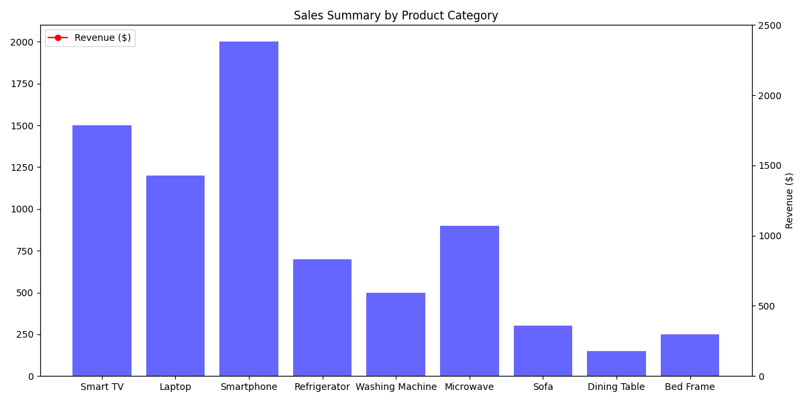
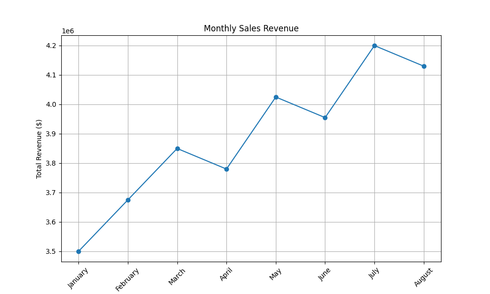
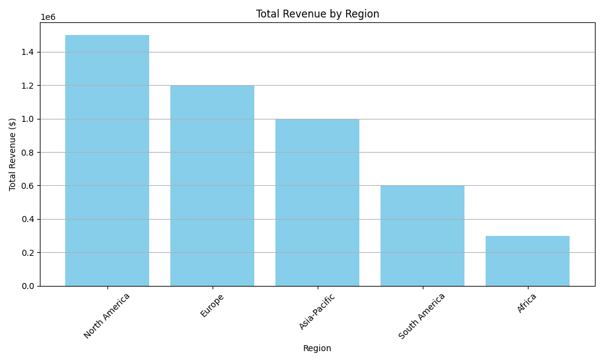

# Sales Performance Report

## Executive Summary
This report analyzes the sales performance over the reporting period, highlighting key metrics and trends in sales data. Overall revenue, top-selling items, regional sales performance, growth comparison, and trends are discussed.

## Overall Revenue
The total revenue for the reporting period was $39,250,000, with consistent growth in several months. 

## Top Selling Items
The top 5 selling items and their generated revenue are:
1. **Smartphone** - $1,200,000
2. **Laptop** - $840,000
3. **Smart TV** - $450,000
4. **Refrigerator** - $350,000
5. **Washing Machine** - $250,000

## Regional Sales Performance
The regions with the most sales and their popular items are:
- **North America**: Total Revenue $1,500,000; Top-Selling Product: Smartphone
- **Europe**: Total Revenue $1,200,000; Top-Selling Product: Laptop
- **Asia-Pacific**: Total Revenue $1,000,000; Top-Selling Product: Smart TV
- **South America**: Total Revenue $600,000; Top-Selling Product: Refrigerator
- **Africa**: Total Revenue $300,000; Top-Selling Product: Sofa

## Growth Analysis
The growth over the reporting period varied by month, with a noteworthy increase of 6.5% from April to May and a consistent trend towards higher sales from January through July.

## Trends Detected
Several trends are evident in the sales data:
- There is a noticeable preference for electronics, particularly smartphones and laptops.
- Month-over-month growth indicates fluctuating sales performance, with significant increases in the latter months of the quarter.

## Appendix
### Charts

