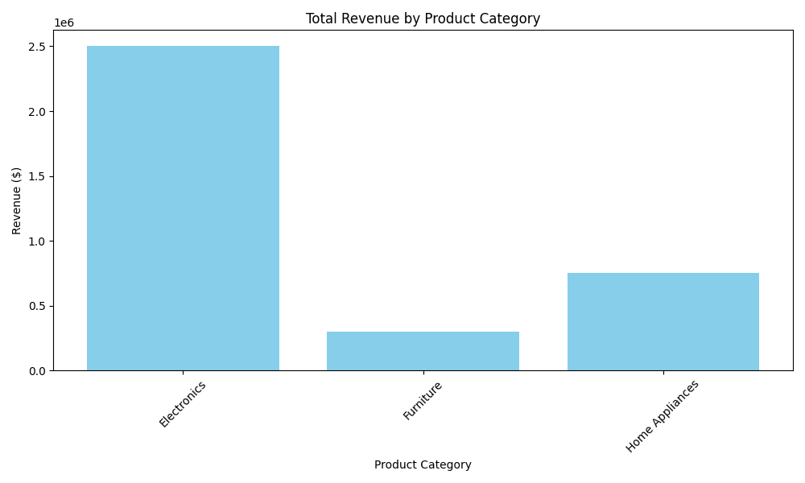
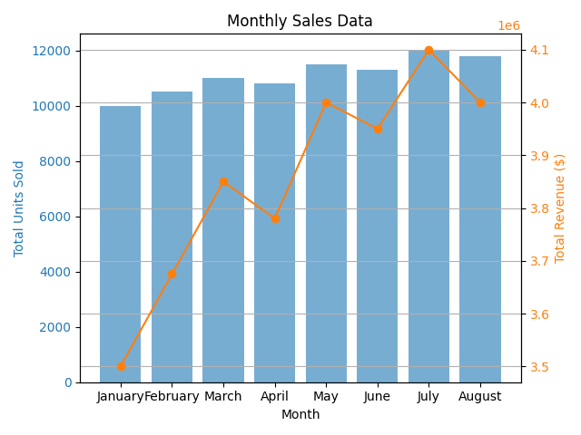
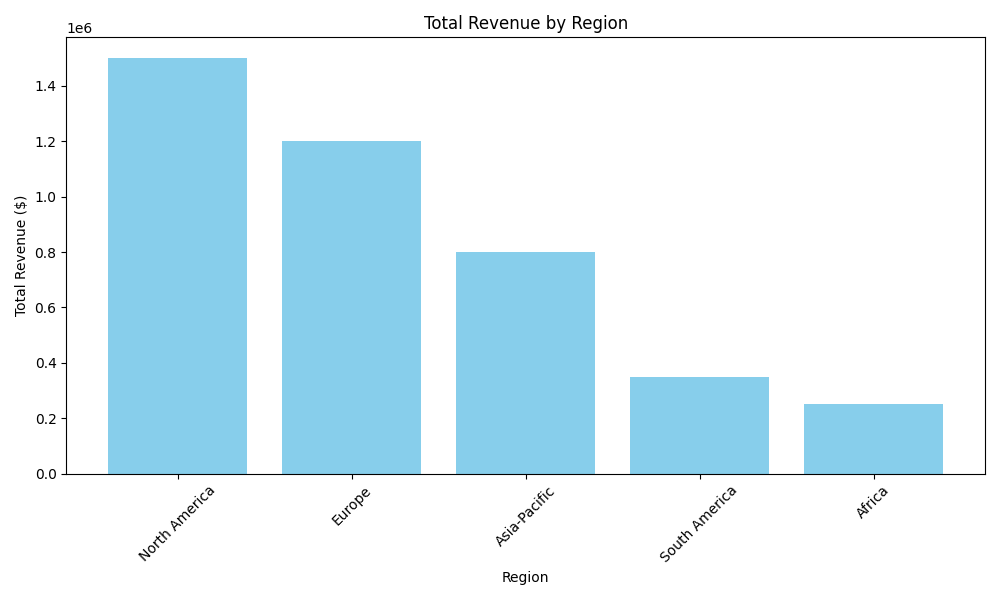

# Sales Performance Report

## Executive Summary
This report analyzes the sales performance of the company over the reporting period, highlighting overall revenue, top-selling items, regional performance, growth trends, and notable observations. The analysis is based on sales data for various product categories, monthly sales figures, and regional performance metrics.

## Sales Overview

1. **Overall Revenue for Latest Month:**
   - **August Total Revenue:** $4,000,000

2. **Top Selling 5 Items:**
   - 1. Smartphone - $1,200,000
   - 2. Laptop - $850,000
   - 3. Smart TV - $450,000
   - 4. Refrigerator - $400,000
   - 5. Washing Machine - $200,000

3. **Regions with Most Sales:**
   - **North America:**
     - Total Revenue: $1,500,000
     - Top-Selling Product: Smartphone (800 units)
   - **Europe:**
     - Total Revenue: $1,200,000
     - Top-Selling Product: Laptop (600 units)
   - **Asia-Pacific:**
     - Total Revenue: $800,000
     - Top-Selling Product: Smart TV (900 units)
   - **South America:**
     - Total Revenue: $350,000
     - Top-Selling Product: Refrigerator (300 units)
   - **Africa:**
     - Total Revenue: $250,000
     - Top-Selling Product: Sofa (150 units)

4. **Growth Over the Reporting Period:**
   - The overall trend shows a consistent increase in sales. For instance, revenue grew from $3,500,000 in January to $4,000,000 in August, indicating a gradual upward trajectory in sales performance.

5. **Trends Detected:**
   - There has been a steady growth in sales of electronics, particularly smartphones and laptops.
   - Seasonality might affect sales, as evidenced by fluctuating monthly performance.
   - New product categories, particularly in home appliances and furniture, show promising growth potential.

## Appendix

- **Sales by Product Category Chart:**
  

- **Monthly Sales Chart:**
  

- **Sales by Region Chart:**
  