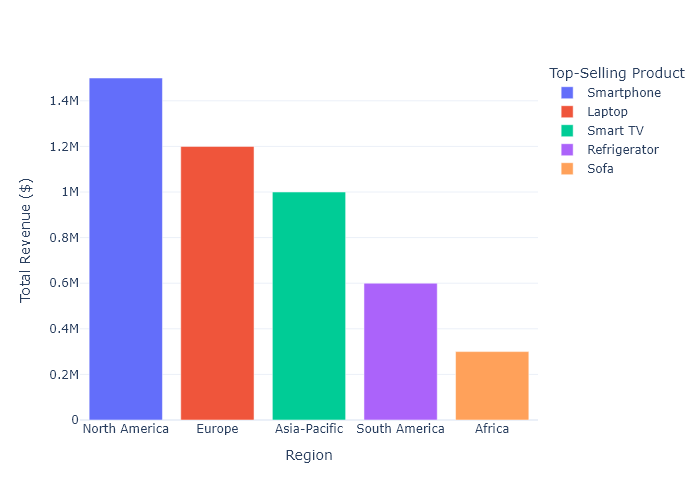

### 1. Executive Summary

- Total sales revenue: $37,250,000
- Percentage increase/decrease from the previous month: +2.5%
- Key highlights:
  - Best-selling product: Smartphone
  - Highest growth: Sofa, +20%

### 2. Sales by Product Category

#### Category: Electronics
- Total sales revenue: $2,520,000
- Percentage change from last month: +4.3%
- Key products: Smart TV, Laptop, Smartphone
- Notes: New TV model launched resulted in increased sales.

#### Category: Home Appliances
- Total sales revenue: $735,000
- Percentage change from last month: +8%
- Key products: Refrigerator, Microwave
- Notes: Promotional discount on refrigerators.

#### Category: Furniture
- Total sales revenue: $270,000
- Percentage change from last month: +10%
- Key products: Sofa, Dining Table
- Notes: Successful marketing campaign boosted sales.

### 3. Sales Trends Over Time

Monthly Sales Comparison:
- Analysis: Sales show a strong upward trend due to the successful launch of new smart appliances in May.

Quarterly Sales Growth:
- Analysis: Q2 outperformed Q1 by 6% due to the introduction of seasonal promotions.

### 4. Regional Sales Performance

#### Region: North America
- Total sales revenue: $1,500,000
- Top-performing products: Smartphone

#### Region: Europe
- Total sales revenue: $1,200,000
- Top-performing products: Laptop

#### Region: Asia-Pacific
- Total sales revenue: $1,000,000
- Top-performing products: Smart TV

#### Region: South America
- Total sales revenue: $600,000
- Top-performing products: Refrigerator

#### Region: Africa
- Total sales revenue: $300,000
- Top-performing products: Sofa

### 5. Insights
- Overall, electronics lead sales, largely driven by smartphone sales. The increase in sales in the furniture category indicates a growing trend towards home improvement products. It's essential to sustain promotional efforts, especially for home appliances, to continue boosting sales in this category.