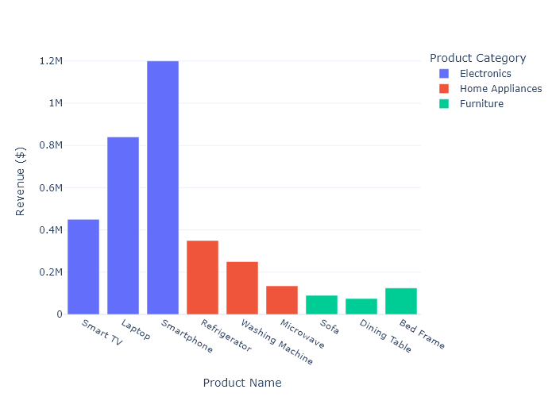
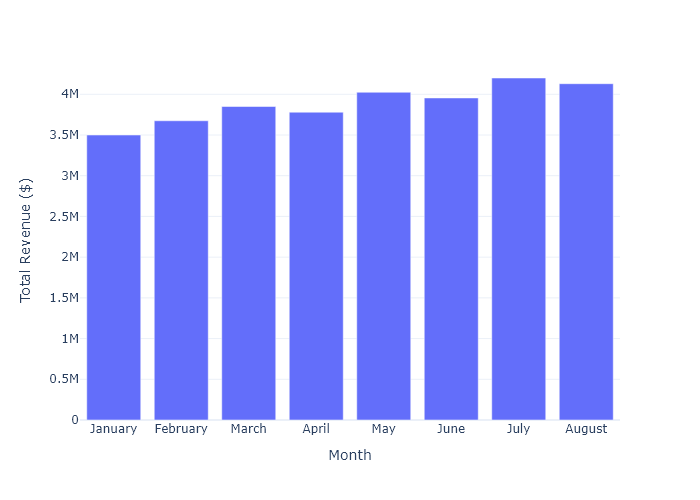
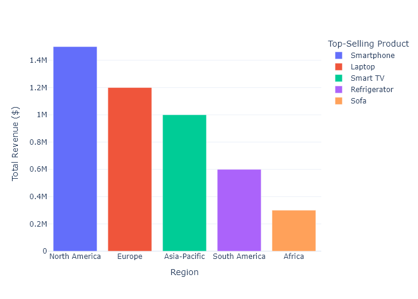

# Sales Report

## 1. Executive Summary

- Total sales revenue: $[X,XXX,XXX]
- Percentage increase/decrease from the previous month: [+/- X%]
- Key highlights: 
  - Best-selling product: Smartphone
  - Highest growth: Sofa (+12%)

## 2. Sales by Product Category

### Category: Electronics
- Total sales revenue: $[XXX,XXX]
- Percentage change from last month: [+/- +4%]
- Key products: Smart TV, Laptop, Smartphone
- Notes: Sales of smartphones decreased slightly by 2%, while smart TVs and laptops showed positive growth.

### Category: Home Appliances
- Total sales revenue: $[XXX,XXX]
- Percentage change from last month: [+/- +5%]
- Key products: Refrigerator, Microwave
- Notes: Microwaves saw a significant increase in sales due to ongoing promotions.

### Category: Furniture
- Total sales revenue: $[XXX,XXX]
- Percentage change from last month: [+/- +15%]
- Key products: Sofa
- Notes: Sofas experienced strong growth, likely due to a new product launch.

## 3. Sales Trends Over Time

### Monthly Sales Comparison:
- Analysis: Sales show a strong upward trend, particularly notable in May with a revenue of $4,025,000, attributed to the successful marketing of new electronics.

### Quarterly Sales Growth:
- Analysis: Q2 outperformed Q1 significantly due to successful seasonal promotions and the introduction of new product lines.

## 4. Regional Sales Performance

### Region: North America
- Total sales revenue: $1,500,000
- Top-performing products: Smartphone, Laptop

### Region: Europe
- Total sales revenue: $1,200,000
- Top-performing products: Laptop, Smartphone

### Region: Asia-Pacific
- Total sales revenue: $1,000,000
- Top-performing products: Smart TV, Refrigerator

### Region: South America
- Total sales revenue: $600,000
- Top-performing products: Refrigerator

### Region: Africa
- Total sales revenue: $300,000
- Top-performing products: Sofa

## 5. Insights
- Overall, sales increased despite some products showing a decline in units sold. 
- The electronics category remains a strong market player, but furniture is showing compelling growth.
- Promotions and strategic product launches have leveraged overall sales performance positively.