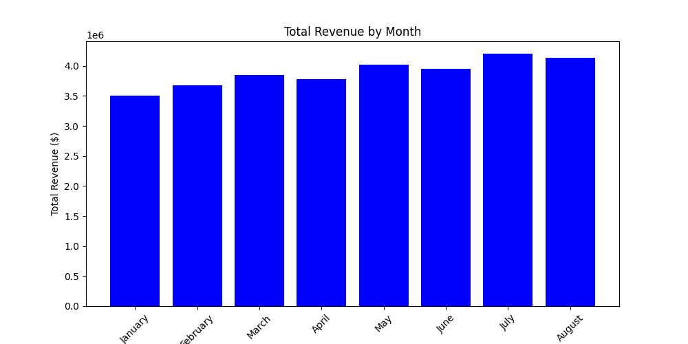

# Monthly Sales Summary

This report provides a summary of the total units sold and total revenue for the sales in the first eight months of the year.

| Month     | Total Units Sold | Total Revenue ($) | % Change (Month-over-Month) |
|-----------|-------------------|---------------------|-------------------------------|
| January   | 10000             | 3500000             | -                             |
| February  | 10500             | 3675000             | +5%                           |
| March     | 11000             | 3850000             | +4.8%                         |
| April     | 10800             | 3780000             | -1.8%                         |
| May       | 11500             | 4025000             | +6.5%                         |
| June      | 11300             | 3955000             | -1.7%                         |
| July      | 12000             | 4200000             | +6.2%                         |
| August    | 11800             | 4130000             | -1.7%                         |

Overall, the data indicates a positive trend in total revenue in the early months followed by a slight decline in some months, with notable increases in May and July.
