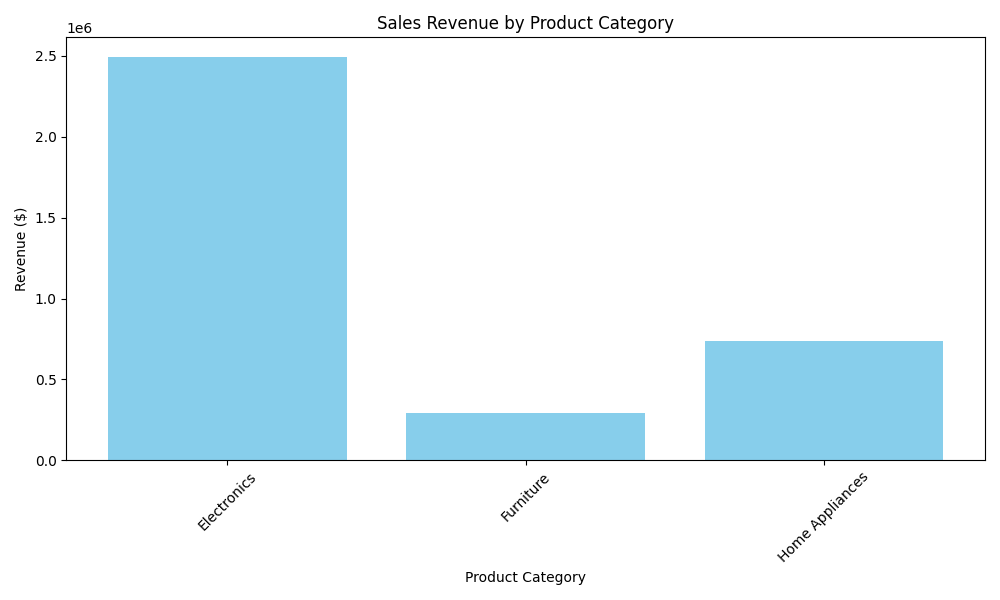

# Sales Revenue Summary by Product Category

## Summary
The sales data by product category shows the following results:

- **Electronics**: 4700 units sold with a total revenue of $2,490,000
- **Furniture**: 700 units sold with a total revenue of $290,000
- **Home Appliances**: 2100 units sold with a total revenue of $735,000

The chart above illustrates the revenue generated from each product category over the analyzed period.