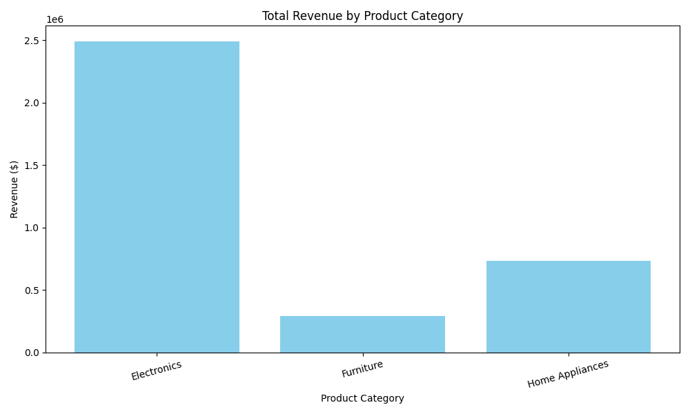
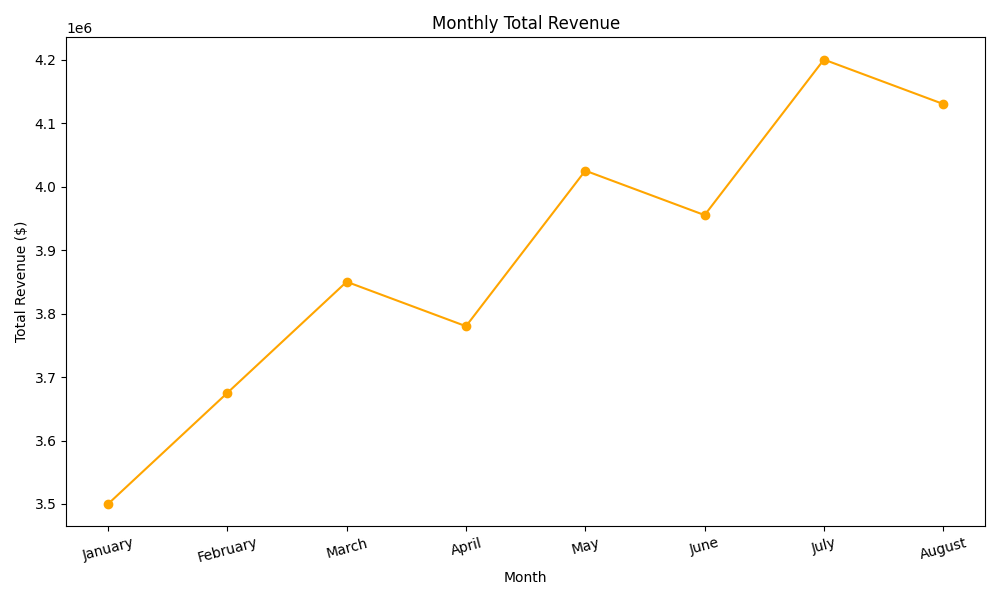
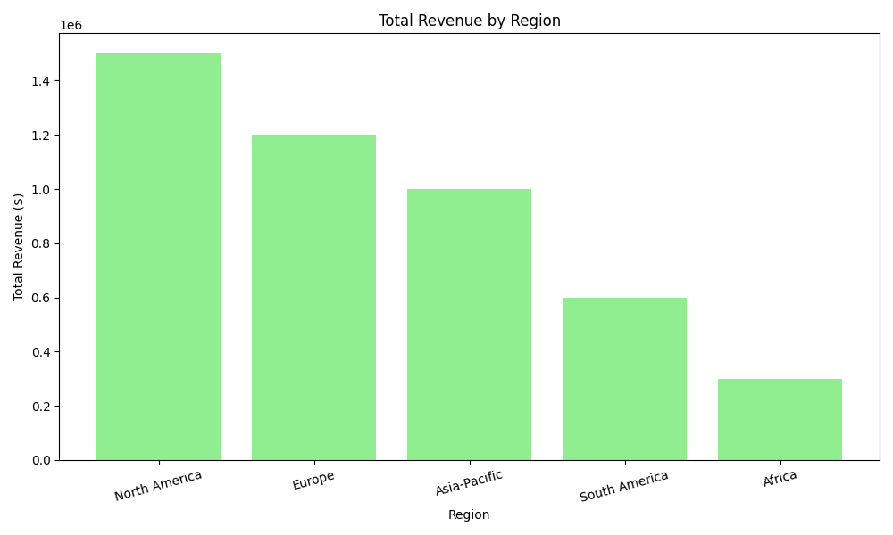

# Sales Report

## 1. Total Revenue by Product Category

| Product Category | Revenue ($) |
|------------------|-------------|
| Electronics      | 2490000     |
| Furniture        | 290000      |
| Home Appliances  | 735000      |

## 2. Monthly Total Revenue

| Month    | Total Units Sold | Total Revenue ($) |
|----------|------------------|--------------------|
| January  | 10000            | 3500000            |
| February | 10500            | 3675000            |
| March    | 11000            | 3850000            |
| April    | 10800            | 3780000            |
| May      | 11500            | 4025000            |
| June     | 11300            | 3955000            |
| July     | 12000            | 4200000            |
| August   | 11800            | 4130000            |

## 3. Total Revenue by Region

| Region          | Total Revenue ($) | Top-Selling Product | Units Sold |
|------------------|-------------------|---------------------|------------|
| North America     | 1500000           | Smartphone           | 800        |
| Europe            | 1200000           | Laptop               | 600        |
| Asia-Pacific      | 1000000           | Smart TV             | 900        |
| South America     | 600000            | Refrigerator         | 300        |
| Africa            | 300000            | Sofa                 | 150        |