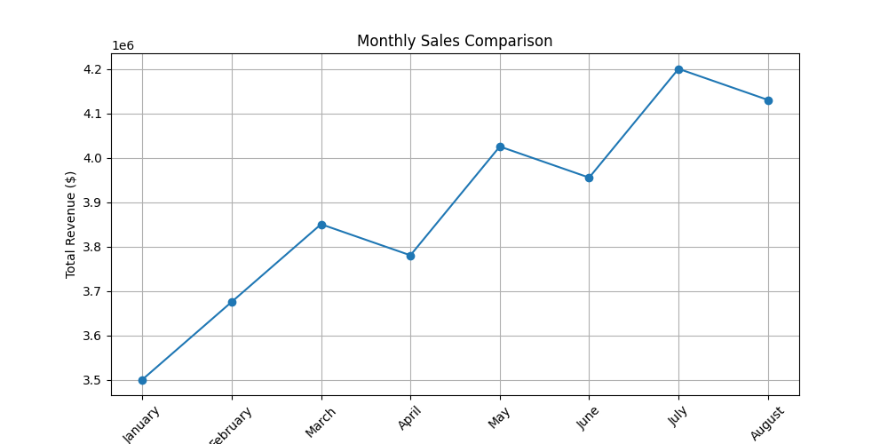
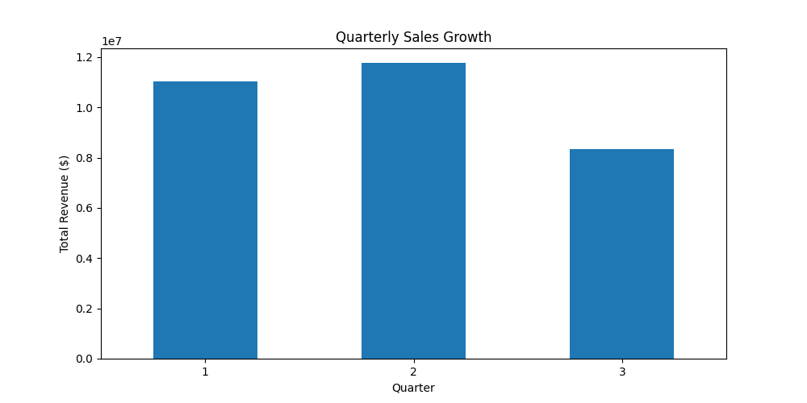

# Sales Report

## 1. Executive Summary
Overall Sales Performance:
Total sales revenue: $4,200,000.00
Percentage change from the previous month: +6.25%

## 2. Sales by Product Category
**Electronics:** Total sales revenue: $2,040,000.00 (Units sold: 4,700)
**Home Appliances:** Total sales revenue: $735,000.00 (Units sold: 2,100)
**Furniture:** Total sales revenue: $125,000.00 (Units sold: 150)

## 3. Sales Trends Over Time
Monthly Sales Comparison:

## 4. Quarterly Sales Growth:

## 5. Regional Sales Performance
**North America:** Total sales revenue: $1,500,000.00, Top-selling product: Smartphone, Units sold: 800
**Europe:** Total sales revenue: $1,200,000.00, Top-selling product: Laptop, Units sold: 600
**Asia-Pacific:** Total sales revenue: $1,000,000.00, Top-selling product: Smart TV, Units sold: 900
**South America:** Total sales revenue: $600,000.00, Top-selling product: Refrigerator, Units sold: 300
**Africa:** Total sales revenue: $300,000.00, Top-selling product: Sofa, Units sold: 150