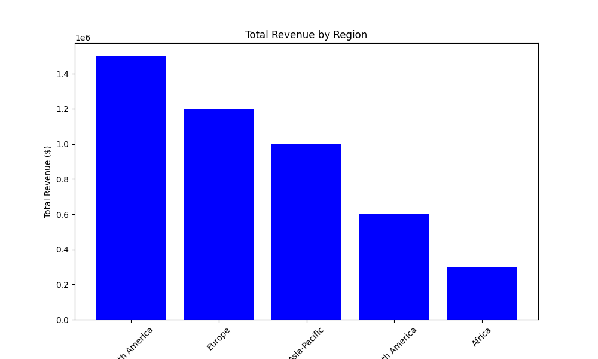

# Total Revenue by Region

## Summary Report
This report provides a visual representation of total revenue across different regions. The bar chart illustrates the following: 
- North America has the highest total revenue at $1,500,000.
- Europe follows with $1,200,000.
- Asia-Pacific shows a total revenue of $1,000,000.
- South America totals $600,000.
- Africa has the lowest total revenue of $300,000.

Overall, the chart gives a quick overview of revenue distribution across the various regions.